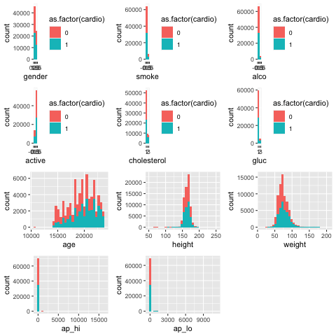
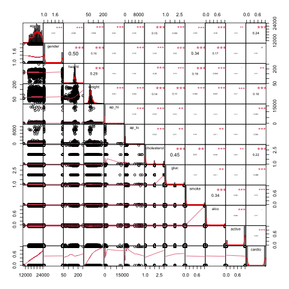
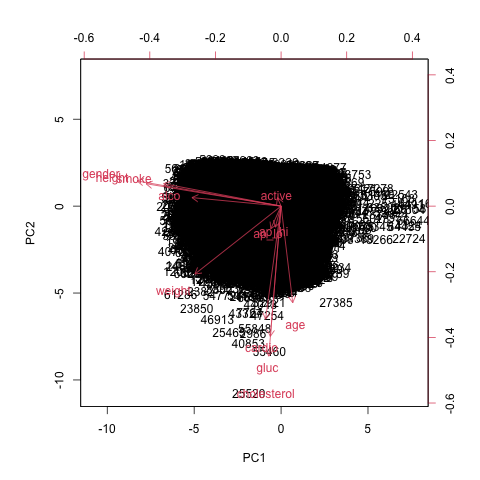
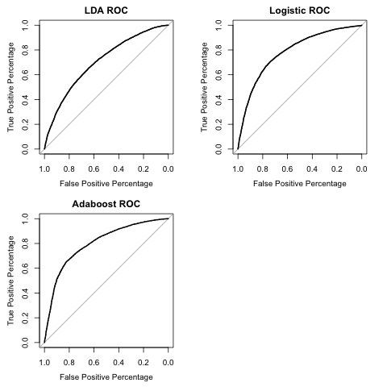

## Introduction to the dataset and intended analysis

Our understanding of cardiovascular diseases is still relatively primitive, and only a relatively limited amount of prevention and intervention methods are available.

The conventional risk factors associated with cardiovascular diseases includes biographical data(age, gender, height, weight), high systolic blood pressure, high diastolic blood pressure, high cholesterol, high glucose and many other chronic diseases. The chosen dataset(<https://www.kaggle.com/datasets/sulianova/cardiovascular-disease-dataset/>) contains not only many of these risk factors, but also contains some novel attributes, like physical activity status, smoking status, and alcohol intake from 70000 patiences. It is interesting to explore if these unconventional attributes would have any contribution to predicting one's likelihood of getting a cardiovascular disease.

A data cleaning step and explorative data analysis (EDA) will be performed first to see the structure of the dataset, the levels of the discrete (categorical) variables, and the distribution of the continuous variables. Also, data visualization could help to identify strong relationship between the covariates, if any. After performing an initial explorative data analysis and visualization, the dataset is analyzed with Linear Discriminant Analysis, Logistic regression, and AdaBoost. The fit is then compared and discussed. We can then see if the interesting novel attributes truly have an influence or not.

## Data cleaning and exploration

The dataset contains the following 13 variables: id, gender, age, height, weight, gender, systolic blood pressure, diastolic blood pressure, cholesterol, glucose, smoking, alcohol intake, physical activity and cardiovascular disease.

Let us first take a look at the discrete (categorical) covariates. For the conventional explanatory variables, we have gender, cholesterol and glucose as dichotomous corvariates. Among them, cholesterol and glucose have three categories as "normal", "above normal", and "well above normal". For the non-conventional explanatory variables, we have smoking, alcohol intake and physical activity as dichotomous corvariates.

There are 45530 females, 24470 males in the dataset. For the smoking status, 63831 never smoked, 6169 smokes in the dataset. There are 66236 never drunk alcohol, 3764 drinks alcohol in the dataset. There are 13739 without physical activities, 56261 with physical activities in the dataset. There are 35021 does not have presence of cardiovascular disease, 34979 has the presence of cardiovascular disease in the dataset. For the Cholesterol status, 52385 is normal level, 9549 above normal level, 8066 well above normal. For the Glucose status, 59479 is normal level, 5190 above normal level, 5331 well above normal. 

Let us then take a look at the continuous covariates. We have age, height, weight, systolic blood pressure and diastolic blood pressure as continuous corvariates.

For the age arrange, the minimum is 10798 and the maximum is 23713. The median is 19703, which is clearly more than the mean 19468.87, indicating that the distribution is left skewed. For the height arrange, the minimum is 55 and the maximum is 250. The median is 165, which is clearly more than the mean 164.36, indicating that the distribution is left skewed. For the weight arrange, the minimum is 10 and the maximum is 200. The median is 72, which is clearly less than the mean 74.21, indicating that the distribution is right skewed. For the weight arrange, the minimum is -150 and the maximum is 16020. The median is 120, which is clearly less than the mean 128.82, indicating that the distribution is right skewed. For the weight arrange, the minimum is -70 and the maximum is 11000. The median is 80, which is clearly less than the mean 96.63, indicating that the distribution is right skewed. 

Finally, for the response variable, 34979 people in the dataset have cardiovascular disease, while 35021 do not.

## Data visualization

Let us then visualize the covariates. The following set of figures visualize the distribution of the discrete (first 6) and continuous (last 5) covariates, respectively. The proportion of having cardiovascular disease is also indicated for each level of the corvariates in the figures.

Then let us plot a correction chart of the explanatory variables together with the response variables, from which we could confirm that the conventional explanatory variables like gender, height, weight, age, glucose and cholesterol have a statistically significant correlation with the cardiovascular disease outcome as expected. Furthermore, it seems that two of the three novel attributes (smoking and alcohol intake) also have significant correlation, while physical activity does not. The findings from Principle Component Analysis is similar.

 

## Model fitting

We separate the data randomly into training (0.75) and testing (0.25) sets, and then use three methods (Linear Discriminant Analysis, Logistic regression, and AdaBoost) to learn and then predict the data.

## Model diagnostics

Ploting the ROC curves generated by these three different methods, and calculate the respective Area Under Curve, we get similar results (which is written into the file 'data_analysis.txt'). All three methods will have AUC value 0.7-0.8, which is excellent. But no one is siginificantly better than another. Furthermore, using stepwise variable selection in the logistic regeression model shows that there are ten variables selected: systolic blood pressure, diastolic blood pressure, smoking, alcohol intake, height, glucose, physical activity, weight, cholesterol and age.

 

## Conclussion and discussion 

For our dataset, two of the novel attributes (smoking and alcohol intake) seem to have a significant correlation with the dichotomous cardiovascular disease outcome during the explorative data analysis stage. The variable selection procedure in logistic regression most often picks some of the conventional variables as important predictors: systolic blood pressure, diastolic blood pressure, height, glucose, weight, cholesterol and age. However, for some seeds (seed=359), physical activity, smoking and alcohol intake are also being selected，which indicates these novel attributes may indeed have some importance in the cardiovascular disease outcome. This is an interesting result and worth further looking into with larger and more balanced datasets. Also, it is worth noting that for analysis of this dataset, the three methods (LDA, Logistic regression, and Adaboost) have similar power in prediction.
